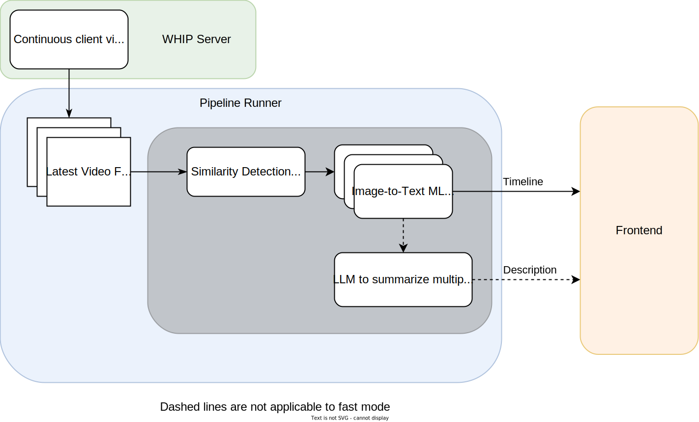

# AI Echo - <small>AI & Cloud-Based Environment Description Service</small>


[AI Echo](https://aiecho.unimplemented.org/) is a service that
provides visually impaired people with a tool to describe their
surroundings in real time. The service uses a combination of image
recognition and language models to provide a detailed description
of the environment. The service is open source and aims to enhance
the independence and quality of life of visually impaired individuals.

Click [here](https://aiecho.unimplemented.org/) to try it out. 👀

# Repository Overview
- [Frontend](frontend) react-based frontend, for more information go to the [README](frontend/README.md)
- [Pipeline](pipeline) python-based sequential pipeline for processing images, for more information go to the [README](pipeline/README.md)
- [Whipcapture](whipcapture) adapted version of whipcapture, for more information go to the [README](whipcapture/README.md)


## Development

All components can be built & deployed using `docker compose`:

```bash
docker compose build && docker compose up
```

This will bring up all functional and infrastructure components,
except for the public facing reverse proxy (not required for
development):


* whipcapture: can be built independently (see [whipcapture](whipcapture/README.md) or use the Dockerfile: `cd whipcapture && docker build -t whipcapture .`)
* pipeline: can be developed locally  (see [pipeline](pipeline/README.md), or use the Dockerfile: `cd pipeline && docker build -t pipeline .`)
* frontend: use `npm install && npm run dev` in the frontend directory

For deployment, take care of the adequate TCP and UDP forwardings
(see docker-compose.yml), configure the reverese proxy accordingly,
and adapt the API URLs in the frontend. Additionally, a pipeline.env
file is required in the pipeline directory (see
[pipeline](pipeline/README.md) for details). Also adapt the (currently
hardcoded) server IP in the whipcapture Dockerfile. This is necessary
for the streaming SDP exchange to work correctly.

## Background

We aim to provide a service that is aimed to give visually impaired people a tool to gather the most important parts of
their surroundings, in real time. This should enhance their ability to solve problems such as finding their glasses.
Though there are similar projects, such as ["be my eyes"](https://www.bemyeyes.com/), which crowdsources descriptions for
images, or its collaboration with OpenAI
["Be My Eyes Accessibility with GPT-4o"](https://openai.com/index/be-my-eyes/), they are closed source, which our
project is not. Furthermore, there are projects that aim to provide local only services, such
as [Whishper](https://whishper.net/), which allows for transcription of videos or subtitling. Our differentiation is
that we aim to provide the service in real time, with an open source approach. It is interesting to apply the use of
LLMs and Image Recognition to Accessibility,as they allow for a fully automated and scalable aid, compared to services
such as "be my eyes".

## Design

The client web app will send their video feed to the Backend, which will analyse the images and use 1 frame per second (fps)
to perform image recognition of the objects. It will then return this output to the client and use the cumulative output
of 5 stills to generate a description that will be sent to the client, where the built-in TTS of the browser will
describe it to the client.

### Frontend

The frontend uses React and Next.js, and incorporates accessibility features, such as descriptive labels, as well as a
high contrast option. It allows for adjustment of the output volume and the selection of the video input as well as
audio output device. The client will hear the description from the built-in browser API Speech Synthesis, alongside a
more detailed fully text-based history that shows the output of the individual frames. There is a Video Feed that shows
the upstreamed video for control.

### Backend



The Backend is written in Go, and it's pipeline can be seen in the figure above.
First the 1 fps limit is enforced, and then similarity detection is performed on the image, comparing to the previous
images. This is used as metadata, as the output needs to differ if there is constant change/movement compared to a
static observer. After the similarity detection is performed, the image is fed into a image to text model. The output is
sent back to the client, and to an LLM, which provides a short summary. Here the metadata that was gathered about the
similarity of frames is relevant in the prompt used. The description is then sent to the client in text form. The prompt
should also generate additional metadata that indicates if a message is urgent, such as tripping hazards.


## Credits
- [Tim Kruse](https://github.com/krusetim)
- [Valentin Dornauer](https://github.com/v4lli)
